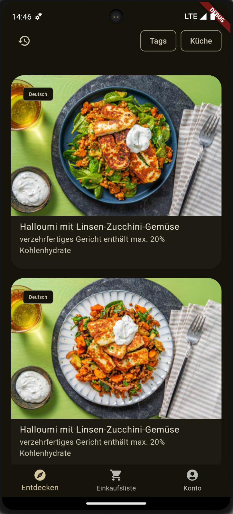
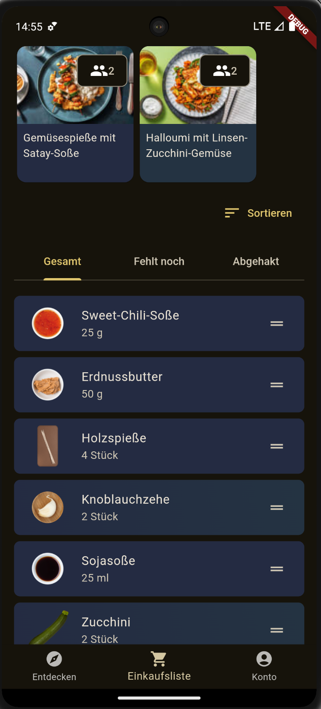
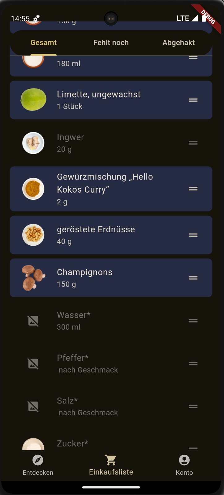
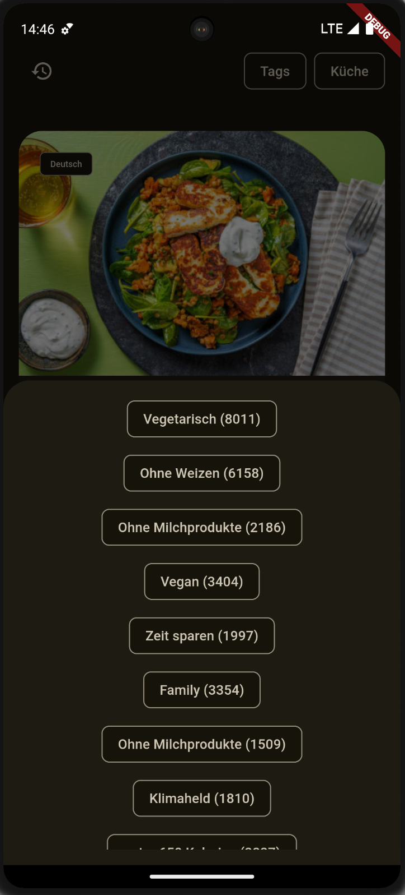
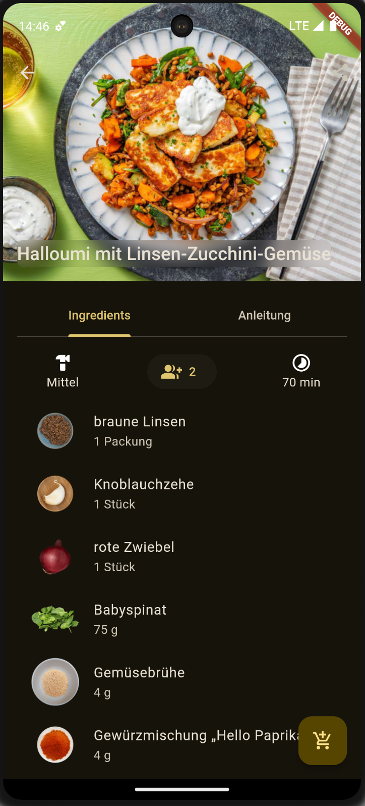

# Food Client


Welcome to **Food Client**, an open-source frontend written in flutter capable of displaying recipes fetched from hello fresh.

## 🚀 Features
- **Endless Filter possibilities**: Filter all hello fresh recipes by tag or cuisine
- **Shopping list**: automatically create a shopping list with all the ingredients you need
- **Shopping list sorting**: sort the shopping list according to your favorite supermarket
- **Cooking tutorials**: Get detailed step by step images and descriptions on how to cook the perfect meal


## 🎨 App Screenshots

Explore **Food Client** through these visuals:

### **Screenshots**
<div style="display: flex; gap: 10px;">
   
   
   
   
   
</div>


## ✨ Details

The recipes are fetched via the hello fresh api using the scripts in the `fetcher_scripts` directory.
The generated graphql files are in the `commons_graphql` directory.
The app lays in the `food_client_app` directory.

## 🛠️ Getting Started

1. Install dependencies:
   ```bash
   flutter pub get
   ```
2. Run the app locally:
   ```bash
   flutter run
   ```


## 💬 Issues

There are some known issues I haven't had time to fix:
- The back navigation is not working on the single recipe page
- The shopping list is not always sorted correctly
- the architecture uses clean boundaries leading to a lot of code, especially through the DIP

## 📝 License

This project is licensed under the [MIT License](LICENSE).


### Made with ❤️ by zelli